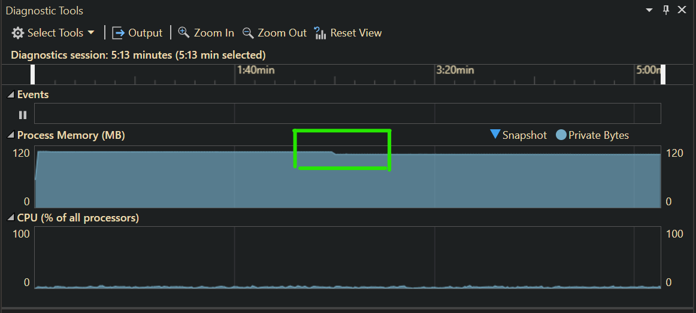
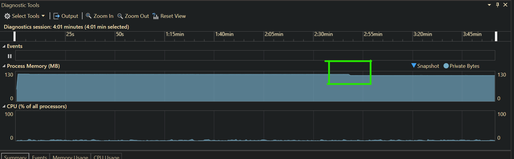
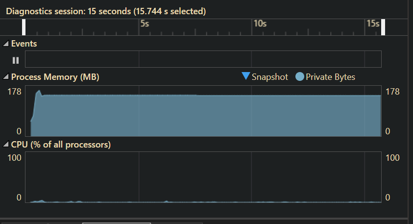
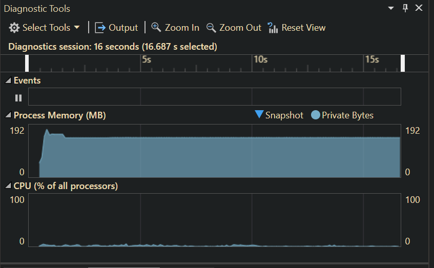
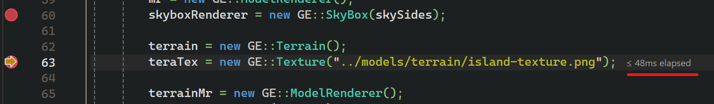

Game Engine Architecture Repo

# ToDo
* Move textures into models ✅
* create method to bind textures to specific models ✅
* create and test sky box and sky dome ✅
* Create hight map and terrain generation ✅
* Add FPS Camera✅
* Add in additional models✅
* Error handling improved ✅

## Project Scene
I am working on a pirate scene for this project whitch takes place on a boat, and the intended manipulation of the pirate around the boat as well as theplayer.
demonstrating objects such as:
* the boat itself ✅
* Trees✅
* Cannon ✅
* Chest ✅
* Crystal ✅
* Volcano ✅
* Kraken Tenticles✅

## Criteria to meet
* Implement a FPS camera.✅
* Load 3D models from a file. You may use external libraries such as assimp but you ✅
* must adapt source code in order to load the models you will be using in the level.✅
* The level must have at least five different static models/objects.✅
* Implement a simple terrain such as a flat plane. ✅
* Allow the user to move around the level using keyboard, mouse or game controller.✅
* Applies UV textures to models/objects and terrains. ✅
* Implements a skybox or skydome. Must explain choice ✅

## Additional Targets
* Fog ✅
* Billboards ✅
* custom model loader✅
* instancing.✅
* Lighting/shadows ✅
* Particle system ✅
* Linux Port ✅

## Diagnostic / Profiling
Performance profiling on my home computer 
#
* skybox implementation has risen the memory usage by 10Mb
* this reduces by 5MB after 2 minutes - this drop off seems to be faster and a lot more on my laptop
* the memory usage with the skybox was approximately 117Mb
* all in all CPU usage seems relatively the same for both usages
 
 
* comparing the sky dome and the skybox performance difference seems to be negligable in the case of my usage. although a higher settup cost when launching the engine. usage stand between 140 - 143Mb in terms of memory usage, although there is a small increase in CPU usage
* this is another thing that could benefit from parallelizing 

* Adding in the custom terrain map adds about 49 - 60ms to the generation there is room to improve this based on the scaling of the landscape 
There are a few ways to improve this code such as Parallelizing pixel generation

